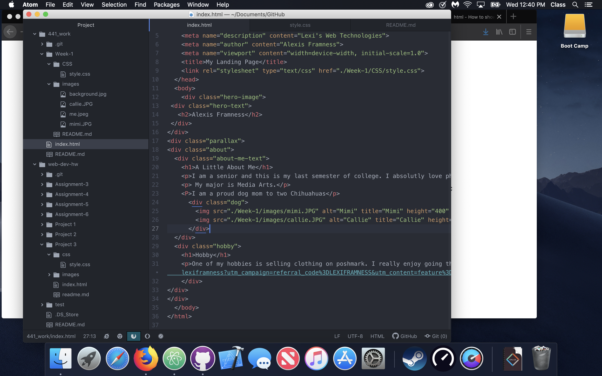

# Assignment 1
Due:Jan 19th, 2019

## Project/Goal
This weeks Assignment was to create a landing page that shared some information about ourselves. The webpage had to include a hero image, and optional use the parallax scrolling feature.

## Workflow
I started out by pulling in my last Assignment from my intro to web design class just to quickly give myself some material to work/play with.

I then started laying out what I wanted this new page to look like. I decided to go ahead and use parallax scrolling, to make the page feel more interesting to interact with.

## Problems
I could not get my "Hobby" section up any higher on the web page, I am not entirely sure why this was, I thought it was a padding issue, but I set the padding to 0 and the issue persisted. If I had had more time to investigate this issue; I am sure I would of solved it. But due to time constraints this week, was unable to do so.

